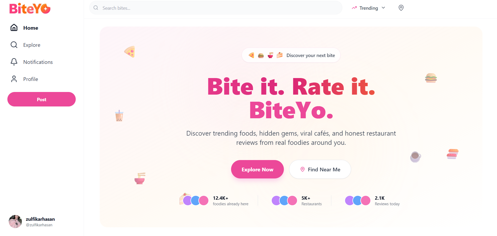
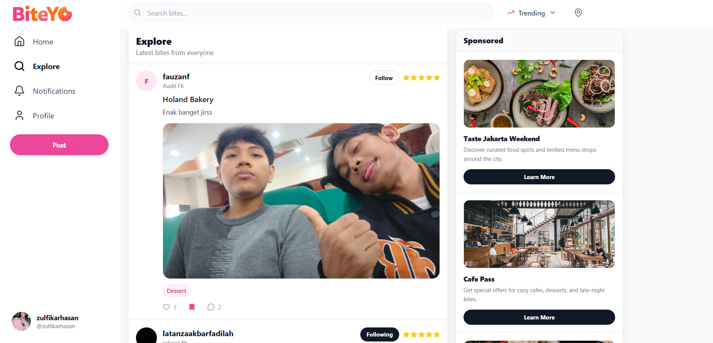
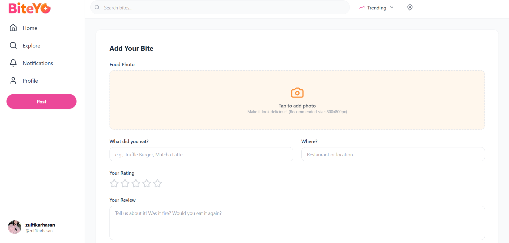
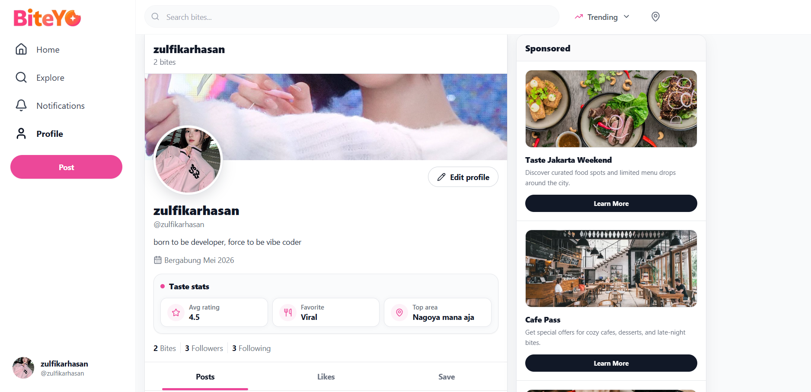
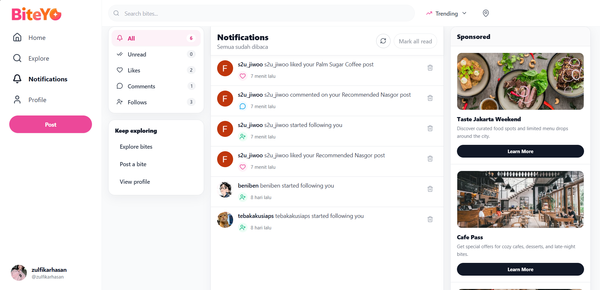

# Biteyo

<p align="center">
  
</p>

<h3 align="center">A social food discovery app for sharing, rating, and exploring your next favorite bite.</h3>

<p align="center">
  
  
  
  
</p>

Biteyo adalah frontend aplikasi sosial bertema kuliner. Fokusnya bukan cuma menampilkan review makanan, tapi membuat pengalaman eksplorasi terasa hidup: cepat, visual, interaktif, dan familiar seperti social feed modern.

## Preview

<p align="center">
  
</p>

<table>
  <tr>
    <td width="50%"></td>
    <td width="50%"></td>
  </tr>
  <tr>
    <td width="50%"></td>
    <td width="50%"></td>
  </tr>
</table>

## Highlights

- **Food-first social feed** untuk melihat bite terbaru lengkap dengan foto, rating, kategori, lokasi, dan review.
- **Explore experience** dengan pencarian lokasi, filter kategori, feed interaktif, serta sidebar konten pendukung.
- **Create bite flow** yang mendukung upload foto, preview gambar, kompresi image, rating bintang, kategori, dan validasi form.
- **Engagement lengkap** melalui like, save, komentar, follow/unfollow, edit, delete, dan detail page per bite.
- **Profile hub** dengan banner, avatar, bio, statistik, timeline post, saved bites, liked bites, dan public profile route.
- **Realtime updates** untuk feed dan notifikasi memakai Supabase Realtime agar perubahan terasa langsung muncul.
- **Responsive navigation** dengan desktop sidebar, sticky header, dan bottom navigation khusus mobile.
- **Polished motion** lewat floating food elements, fade-up hero, pulse background, modal animation, loader dots, hover states, dan micro-interaction pada tombol.

## Product Feel

Biteyo dibangun dengan gaya visual yang ringan, fun, dan tetap rapi: warna pink-oranye sebagai aksen utama, card feed yang bersih, rounded media, icon-based actions, sticky section header, serta loading dan empty state yang tidak terasa mentah.

Pengalaman utamanya diarahkan ke tiga alur:

1. **Discover**: pengguna masuk ke home/explore untuk menemukan makanan, tempat, dan review.
2. **Share**: pengguna membuat bite baru dengan foto, rating, review, dan kategori.
3. **Engage**: pengguna berinteraksi lewat like, save, komentar, follow, dan notifikasi.

## Key Screens

| Screen | Fokus Pengalaman |
| --- | --- |
| Home | Hero animated, CTA explore, kategori trending, dan first impression brand. |
| Explore | Feed utama, pencarian lokasi, filter kategori, action message, dan realtime refresh. |
| Post | Form tambah bite dengan image preview, rating bintang, kategori, dan upload terkompresi. |
| Profile | Identitas user, edit profile, timeline, saved bites, liked bites, dan follow state. |
| Notifications | Filter notifikasi, unread counter, mark as read, delete, refresh, dan realtime listener. |
| Bite Detail | Review detail, foto besar, kategori, rating, like/save, dan thread komentar. |

## Tech Stack

React, Vite, Tailwind CSS, React Router, Axios, Supabase, Google OAuth, Lucide Icons, dan Swiper.

## Quick Start

```bash
npm install
npm run dev
```

Build production:

```bash
npm run build
```

Lint:

```bash
npm run lint
```

## Environment

Buat `.env.local` di root project, lalu sesuaikan value dengan backend dan service yang dipakai.

```env
VITE_API_BASE_URL=http://localhost:3000
VITE_API_URL=http://localhost:3000
VITE_GOOGLE_CLIENT_ID=your_google_client_id
VITE_SUPABASE_URL=your_supabase_url
VITE_SUPABASE_ANON_KEY=your_supabase_anon_key
```

## Project Structure

```txt
src/
  assets/       Logo, favicon, background, dan preview page
  components/   Reusable UI, sidebar, feed card, notification, profile sections
  hooks/        Feed socket, profile data, dan bite mutation logic
  pages/        Home, explore, post, profile, notification, auth, detail bite
  services/     API dan realtime service layer
  utils/        Auth, normalization, image compression, engagement helpers
```

## Deployment

Project sudah siap untuk SPA deployment di Vercel melalui `vercel.json`, sehingga route seperti `/explore`, `/profile/:username`, dan `/bites/:biteId` tetap diarahkan ke `index.html`.

## Status

Frontend Biteyo sudah mencakup flow utama aplikasi sosial kuliner: discovery, posting, engagement, profile, dan notification. Backend API, Google OAuth, serta Supabase credential tetap perlu dikonfigurasi agar seluruh fitur berjalan penuh.
